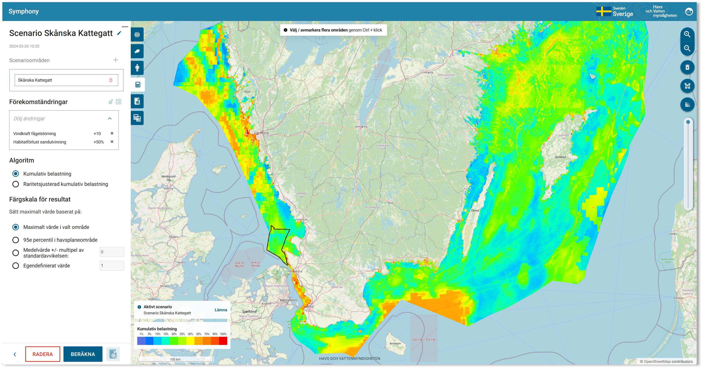

# Symphony: A tool for ecosystem-based marine spatial planning

Symphony is a method developed by the Swedish Agency for Marine and Water Management (SwAM), to quantitatively weigh 
ecosystems and environmental pressures. With Symphony, the cumulative environmental impact from different marine spatial
planning (MSP) options can be objectively compared. Cumulative environmental impact refers to the combined pressure from
different kinds of human activities on the marine ecosystems. This cumulative impact indicates the consequences for the
environment. In this way, marine spatial plans can be developed with an ecosystem approach.

This repository contains a specific implementation conceived as an application facilitating building and evaluation 
of Symphony scenarios, continually developed at the agency since 2019. For more details on the science behind the Symphony
method see the [project web page at the Swedish Agency for Marine and Water Management](https://www.havochvatten.se/en/eu-and-international/marine-spatial-planning/swedish-marine-spatial-planning/the-marine-spatial-planning-process/development-of-plan-proposals/symphony---a-tool-for-ecosystem-based-marine-spatial-planning.html).

## Features overview

The system is designed to make it as easy and convenient as possible to carry out sophisticated cumulative impact 
analysis,
with special emphasis on the building and comparison of different scenarios. This way, marine planners and managers can get an overview of current environmental impact across geagraphy and also get an estimate on environmental consequences of different planning decisions (scenarios). The main features include:

- View individual data layers (ecosystem component maps and human pressure maps)
- Create polygons for further analysis
- Perform baseline scenario analysis over an arbitrary geographical region (uploaded or drawn polygons, single or 
  grouped)
- View (and export) graphical and statistical measures of analysis results, including Sankey 
  charts of the impact relationship between components, and cumulative impact of individual components
- Apply, view, select, and edit sensitivity matrices used for analysis 
- Choose among different result normalization methods, including the ability to specify a user-defined custom 
  normalization value
- Apply linear transformations over arbitrary regions in a scenario ( $x' = A x + B$, where $x$ is the component 
  intensity at the data point and $x'$ the actual value used in the cumulative impact analysis)
- Create persistent scenarios consisting of arbitrary numbers of transformed subareas
- Compare two scenario analyses result side-by-side, including relative differences in graphical and tabular form 
- Ability to make use of user-drawn custom polygons, or upload a polygon definition created in another GIS tool

## Architectural overview

The system has been conceived according to SWaM development standards. In concrete terms this implies a web 
architecture with a Jakarta EE-based backend and a frontend built as an SPA 
using Angular. Persistent data is managed using JPA and stored in a PostgreSQL database (with spatial extensions) and 
raster data on a filesystem. Authentication is delegated to the application server and can thus be tailored to 
organizational needs.

### Implementation recommendations

While any Jakarta EE 8.0-compliant application should be OK, during development [Wildfly](https://www.wildfly.org/)
has been used and is thus the recommended choice. At SwAM the frontend is served separately using Apache, 
although any web server capable of serving static content should do (see [Frontend](#frontend-1) below). The backend 
has been tested using Wildfly 26.1, PostgreSQL 10 and PostGIS v2.4, but more recent versions should be fine.

The frontend is realized as an Angular application (v 17), built with Node 20.11.1.

## Getting the source

There are some test and benchmark code which relies on test resources. For practical reasons these are stored in a 
separate [repository](https://github.com/havochvatten/MSP-Symphony-Testdata.git) and added as a Git submodule. 
Therefore, if you would like to run said tests and benchmark code you need to do a recursive clone of this 
repository, like so:
```
git clone --recurse-submodules https://github.com/havochvatten/MSP-Symphony.git
```

Alternatively (if you are cloning through an IDE or such which doesn't allow you to specify the `--recurse-submodules` flag), you can do
```
git submodule update --init 
```
after doing a regular (non-recursive) clone.

## Building

### Backend

The backend is located in the `symphony-ws` directory and is standard single-module Maven project. Building 
should be a matter of:
```
cd symphony-ws
mvn package -DskipTests
```
The build artifacts will end up in the `target` directory.

There are also tests which can be invoked by Maven, see the section on [Tests](#testing) below.

### Frontend

The frontend is managed by Angular CLI, and should thus behave like any other Angular CLI-project. There is more 
extensive information in [frontend/README](frontend/README.md), but in short a production build should 
be a matter of:
```
cd frontend
npm install -g @angular/cli
npm install
ng build
```
The build artifacts will end up in the `frontend/dist` directory.

For frontend development there is also the Angular CLI development server, see the frontend README for more details. 

## Configuration and Deployment

### Backend

There are a few steps needed to get the backend up and running:

#### 1. Configure the application server

The system has only been tested in Wildfly and its standalone mode, using the `standalone-full.xml` configuration. At 
least two things need be added to the stock Wildfly configuration:
1. A *SymphonyDS* data source
2. A security domain. By default, the security domain is called *LDAPAuth* in the `jboss-web.xml` file.  

In the case of Wildfly, the data source may be added through the Wildfly CLI, through the web-based management 
console, or directly in the configuration file as the below XML fragment:

```
<datasource jndi-name="java:/SymphonyDS" pool-name="SymphonyDS">
    <connection-url>jdbc:postgresql://DATABASE-HOST:5432/symphony</connection-url>
    <driver>postgresql</driver>
    <security>
        <user-name>DATABASE-USER</user-name>
        <password>DATABASE-USER-PASSWORD</password>
    </security>
    <validation>
        <valid-connection-checker class-name="org.jboss.jca.adapters.jdbc.extensions.postgres.PostgreSQLValidConnectionChecker"/>
        <background-validation>true</background-validation>
        <exception-sorter class-name="org.jboss.jca.adapters.jdbc.extensions.postgres.PostgreSQLValidConnectionChecker"/>
    </validation>
</datasource>
```
As for the security domain, it would depend on the needs of your organisation and installation environment. For an 
example of a simple setup relying only on a separate filesystem user database see for instance
[this guide](http://www.mastertheboss.com/jbossas/jboss-security/configuring-http-basic-authentication-with-wildfly/).

#### 2. Populate the database

In order for the system to work the database need to be populated with data. Separate instructions for this 
procedure is provided in [DataImportREADME](database/DataImportREADME.md).

#### 3. (Optional) Override the application runtime configuration properties

The file `/app/config/symphony/symphony-global.properties` (`C:\app\config\symphony\symphony-global.properties` on 
Windows) can be used to override the default application properties bundled in the resource 
[symphony-global.properties](symphony-ws/src/main/resources/symphony-global.properties). In particular, the 
_api.base_url_ property may want to be overridden to point to a remote server when running the API tests. 

#### 4. Java VM Runtime flags

It is a very good idea to give the system ample heap space to work with, at least a few GBs. Example: `-Xmx10G`

The system assumes that all strings related to area polygons are in UTF encoding. Current JVMs typically defaults to 
the default native platform encoding. Notably, on Windows that is not UTF and so if running on Windows specifying
`-Dfile.encoding=UTF-8` may be necessary (that setting is used also when reading data from the datbase).

### Frontend

In the interest of efficiency the frontend may be served by a separate frontend server. In the case of Apache 
an example virtual host file is included [here](example-config/apache/vhosts.d/example-vhost.conf). To maintain the 
same-origin policy and avoid CORS issues the frontend server needs to proxy REST API calls. The above sample Apache 
configuration file illustrates how to accommodate this.


## Testing

For the backend there are unit tests and tests exercising the REST API. Which one to run is controlled through a 
pair of Maven profiles.

The _skip-apitests_ is active by default, and so running it is matter of:
```
mvn test
```
To run only the API tests activate the _only-apitests_ profile:
```
mvn test -Pskip-apitests
```

### REST API tests credentials

The API tests need credentials which are acquired from the four properties *symphony.username*, *symphony.password*,  
*symphony.adminusername*, and *symphony.adminpassword*, whose values need to be set appropriately.

They can either be specified in the application properties file (`/app/config/symphony/symphony-global.properties`) 
or using a set of -D flags when invoking Maven:
```
mvn surefire:test ... -Dsymphony.username=XXXX -Dsymphony.password=YYYY ...
```


### Frontend tests

There are also frontend tests, see [frontend/README](frontend/README.md) for more details.

### Swagger (partially disabled)

A previous Swagger integration has been partially disabled (won't generate documentation) in the build since release  
version 1.3 due to certain compatibility issues with the internally recommended application server software (WildFly 26).
However, the dependency remains in the software package, providing OpenAPI annotations.  
Reintroducing the 'Swagger UI' capability is being considered.

~~The package comes bundled with [Swagger](https://swagger.io/) which can be used for exploring APIs and debugging, but
may want to be disabled in a
production environment. By default it is available at the */symphony-ws/swagger* endpoint.~~

## License

Symphony is licensed under the 2.0 version of the Apache License, see [LICENSE](LICENSE).
